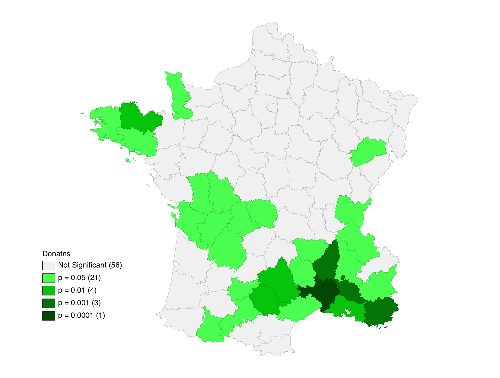
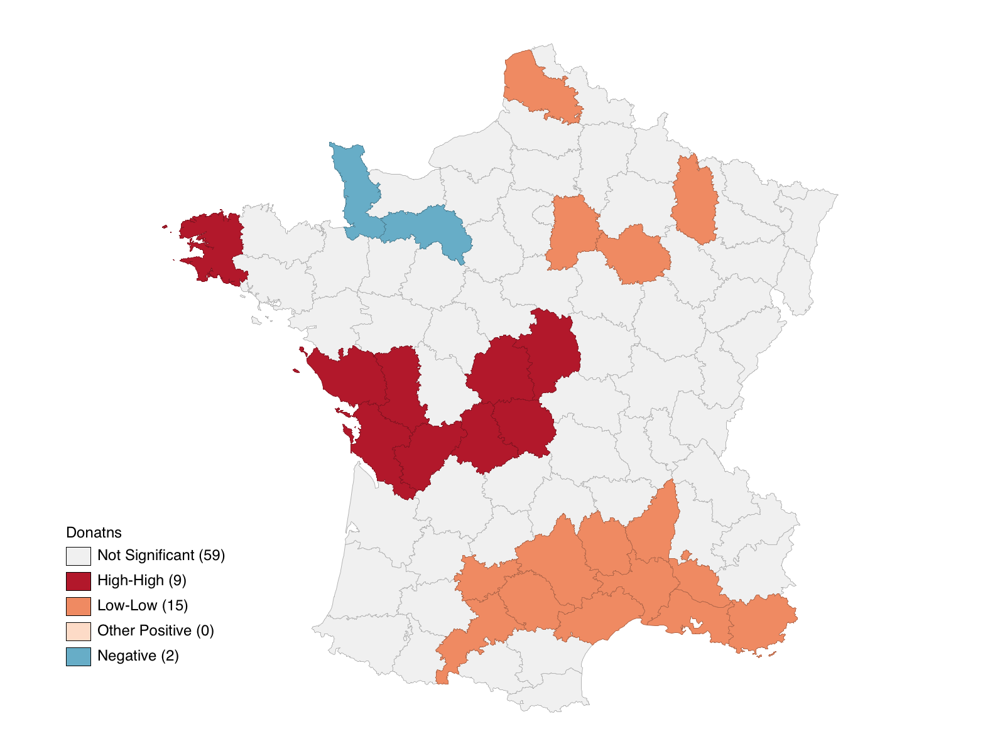
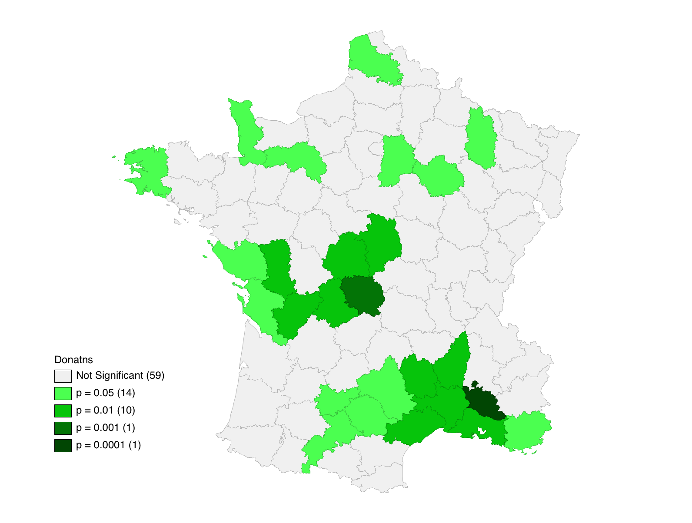
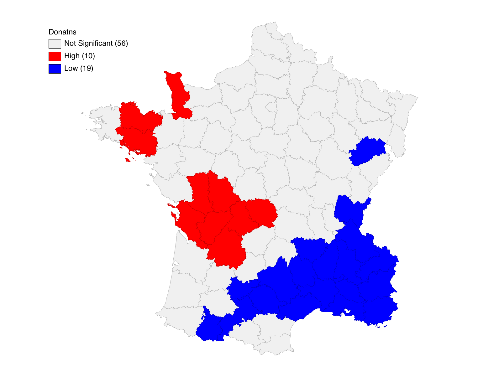
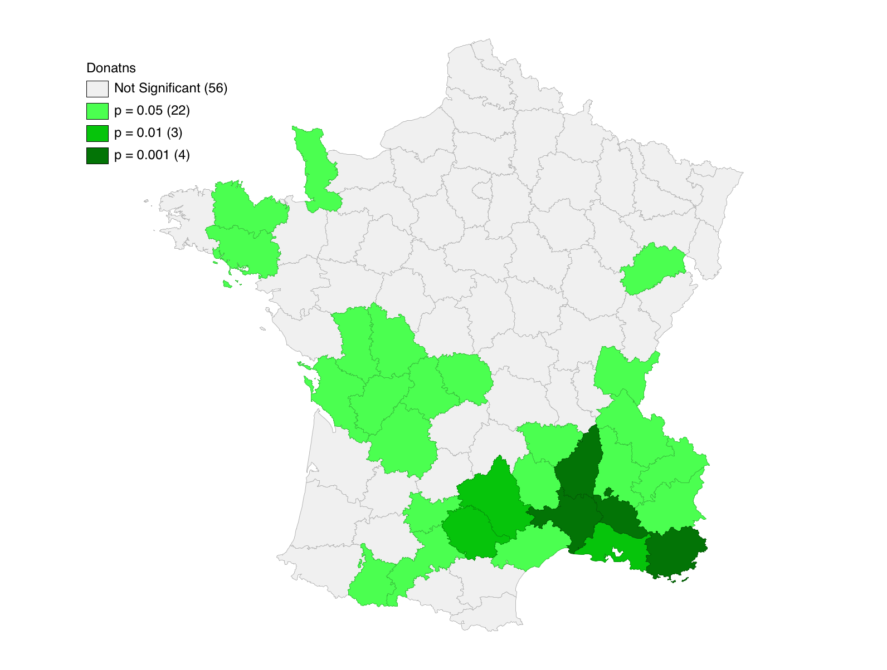
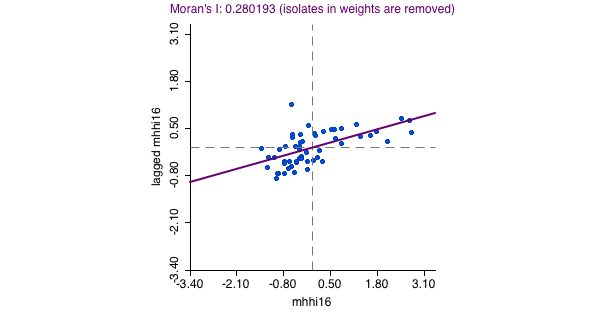
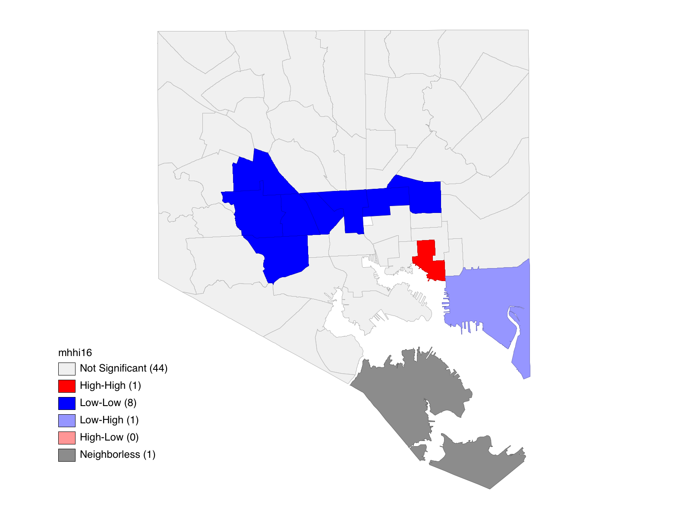

Travis Lageman; Lab 6
---
All maps produced in GeoDa.

### Part 1

#### 1. Local Moran Maps

##### Cluster Map

##### Significance Map

#### 2. Local Geary Maps

##### Cluster Map

##### Significance Map

#### 3. Getis-Ord Gi Maps

##### Cluster Map

##### Significance Map

### Part 2

Spatial Weights were created based on polygon id for Baltimore City Community
Statistical areas from BNIA-JFI's 2016 Vital Signs Dataset. These Weights
were used to perform a Local Moran's I on median household income values. The
Moran's I value shows a slight positive autocorrelation: 0.280193

##### Moran's I Plot

##### Cluster Map of Median Household Income

This map shows a row of community statistical areas from east to west that
have low median incomes surrounded by other neighborhoods with low median
incomes. These occur in known historically underserved "butterfly-shaped"
predominantly African-American neighborhoods. Meanwhile, the only significant high income neighborhood surrounded by other high income neighborhoods is located in an area (Canton) known to be predominantly white and wealthy.

### Part 3

For Part 3, I chose to perform a regression to see if there was any correlation between median household income and household size. Performing a regression with spatial weights indicated that there was significant, slight postive autocorrelation and a spatial error should
be performed (based on the Lagrange Multipliers).

After running the spatial error, the results show a negative correlation between household income and household size. As household size increases, income logically decreases. (See results below.)

------------------------------------------------------------------------
       Variable       Coefficient     Std.Error       z-value    Probability
          CONSTANT        113738        21203.1        5.36423     0.00000
          hhsize16      -26381.6        8153.09       -3.23578     0.00121
            LAMBDA      0.540129       0.142861        3.78081     0.00016
------------------------------------------------------------------------
