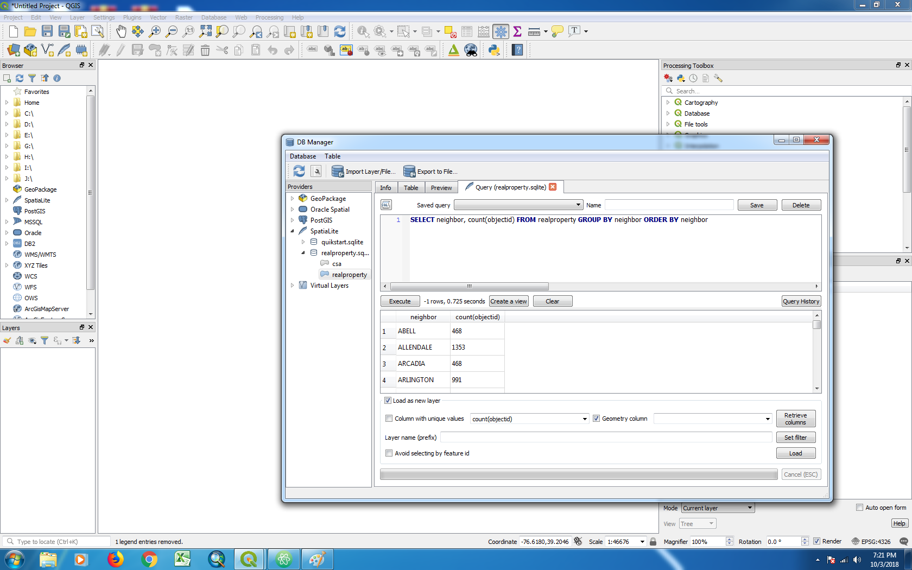

Project 1
---
Travis Lageman

### Project Description:

  **Methods:**

  1/4 mile Hexagonal grids were created across Baltimore City and joined with 311 Requests for Rat Rubout/Rodents (from 2014-Present). Each grid was assigned a shade based on the number of requests it contained using Natural Jenks classification. This number was used to represent height in a 3-D Map with the Qgis2threejs plug-in.  Height was exaggerated slightly using the vertical exaggeration field (value = 15). This layer was laid over a digital elevation model of Baltimore City. Finally, community statistical areas with > 50% African-American Population (Blue) or > 50% White population (Gray) were identified and overlaid on the hexagonal grids. All project materials were projected to NAD 83 State Plane Maryland FIPS 1900 Feet. A 2-D Map was also created as a counterpart to the 3-D Map. Both of which were created in QGIS 3.2.

  Spatial Lite Queries were also conducted to pull out information from the Real Property Dataset. The three queries developed (screenshots included in products folder) produced the following information that could be used in further analysis of 311 Rat Requests:
  * Number of pre-1900 built properties by neighborhood
  * Total number of properties by neighborhood
  * Average tax value of properties by neighborhood

  **Conclusion:**

  It was observed that a significant proportion of 311 Rat Requests were attributed to predominatly Black neighborhoods in Baltimore City. A quick visual scan of either the 2-D or 3-D maps shows significantly higher numbers of requests in West, East, and Northwest Baltimore all of which correspond with predominatly Black neighborhoods.

  Further analysis could be carried out with the information provided by the SQL queries, which might provide insight into a relationship between 311 Rat Requests, age of property and property value.

  

  

  ### Data:
  * Baltimore City Real Property Database - [Baltimore City Open GIS Portal](https://gis-baltimore.opendata.arcgis.com/datasets/b41551f53345445fa05b554cd77b3732_0)
  * Baltimore City Community Statistical Area with Demographic Data - [BNIA](https://bniajfi.org/)
  * 311 Service Requests for Rat/Rodent Problems - [Baltimore City Open GIS Portal](https://data.baltimorecity.gov/City-Services/311-Customer-Service-Requests/9agw-sxsr)
  * Baltimore City Digital Elevation Model - MD iMAP -  [Maryland Mapping and GIS Portal](https://imap.maryland.gov/Pages/lidar-dem-download-files.aspx)

### Plug-ins/Tools:
  * Qgis2threejs
  * Database Manager

### SQL Queries:
* SELECT neighbor, count(objectid) FROM realproperty WHERE year_build < 1900 AND year_build !=0 GROUP BY neighbor ORDER BY count(objectid)
  - This query identifies the number of identified pre-1900 built properties by neighborhood and organizes them in ascending order.

* SELECT neighbor, count(objectid) FROM realproperty GROUP BY neighbor ORDER BY neighbor
  - This query presents a count of the number of properties in each neighborhood, which could be used to determine a ratio of pre-1900 properties for each neighborhood.

* SELECT neighbor, avg(taxbase) FROM realproperty GROUP BY neighbor ORDER BY avg(taxbase)
  - This query determines the average of the taxbase value for each neighborhood.

