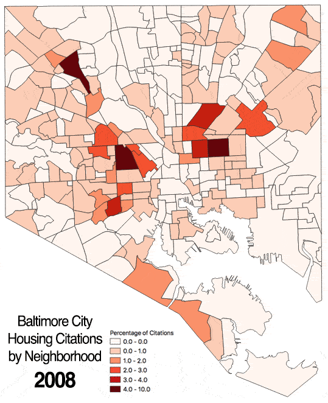

Project 2
---

Travis Lageman

#### Baltimore City Housing Citations (2008-2018)



##### Project Description:

Housing Citations issued by Baltimore City are shown from 2008
to 2018 by neighborhood. The number of citations in each neighborhood
is represented as a percentage of total citations given in that year.

The classifications used for map symbology were chosen to highlight the neighborhoods with the greatest relative percentages of citations by year (at least 1%). These findings show that citations have consistently been focused on East and West Baltimore with some other  notable neighborhoods including Curtis Bay, Park Heights and Belair-Edison.

Some important historical context to consider:
* 2008/9 was a period of recession in the U.S.
* 2010 was the first year of Mayor Stephanie Rawlings-Blake's [Vacants to Value (V2V) initative](http://www.vacantstovalue.org/vtov_faq), which still relies on streamlined [Code Enforcement](https://www.citypaper.com/news/mobtownbeat/bcp-090716-mob-v2v-20160906-story.html) to address neglected properties to the present day.
* 2016 (December) Mayor Catherine Pugh took office in Baltimore and has pledged to perform massive reinvestment projects. This means tearing down vacant homes which requires acquiring them first [Video](https://www.baltimoresun.com/news/maryland/baltimore-city/bs-md-ci-vacant-demolition-blocks-20180227-story.html)

##### Data:

* [Baltimore City Housing Citations Dataset](https://data.baltimorecity.gov/Housing-Development/Housing-Citations/pugq-wdem)
* [Baltimore City Neighborhoods Shapefile](http://gis-baltimore.opendata.arcgis.com/datasets/neighborhoods)

##### Project Steps:

1. Housing Citation data was downloaded from Open Baltimore.
2. Housing Citation data was geolocated using ESRI.
3. All data was projected into NAD 83 State Plane Maryland FIPS 1900 Feet.
4. Data was clipped with Baltimore City Neighborhood polygon.
5. Field calculator was used to generate a "Year" field with year of violation.
6. Python code was written to select features for each year (2008-18)
and write those selected features to a new shapefile for analysis. (see Code)
7. Each newly created point shapefile was then loaded and counted using the
'Count Points in Polygon' function with the Neighborhoods polygon as a batch process. Each file saved as CountYear.
8. Field caclulator used to calculate the percentage of citations in each neighborhood by using total number of citations from each year shapefile.
9. Symbology set to graduated and classified manually. Style copied to each CountYear shapefile.
10. Each layer image was saved and imported to photoshop to create gif with a 1 second delay for each image.


##### Python Code:

ref link: https://gis.stackexchange.com/questions/131158/how-to-select-features-using-an-expression-with-pyqgis

```python

# This code loads a point file and then selects features based
# on the year of the feature and writes those features of the
# same year to a new file

layer = iface.addVectorLayer("/Users/tjleggz/Desktop/GES 687/Project2_Lageman/shapefiles/HousingCitationsProj.shp", '', 'ogr')

y = 0
year = 2008
while y < 11:
    strYear = str(year)
    layer.selectByExpression(" \"Year\" = '{}' ".format(strYear), QgsVectorLayer.SetSelection)
    year = year + 1
    y = y + 1
    QgsVectorFileWriter.writeAsVectorFormat(layer, '/Users/tjleggz/Desktop/GES 687/Project2_Lageman/shapefiles/' + strYear + '.GPKG', 'utf-8', layer.crs(),'GPKG', True)
```
