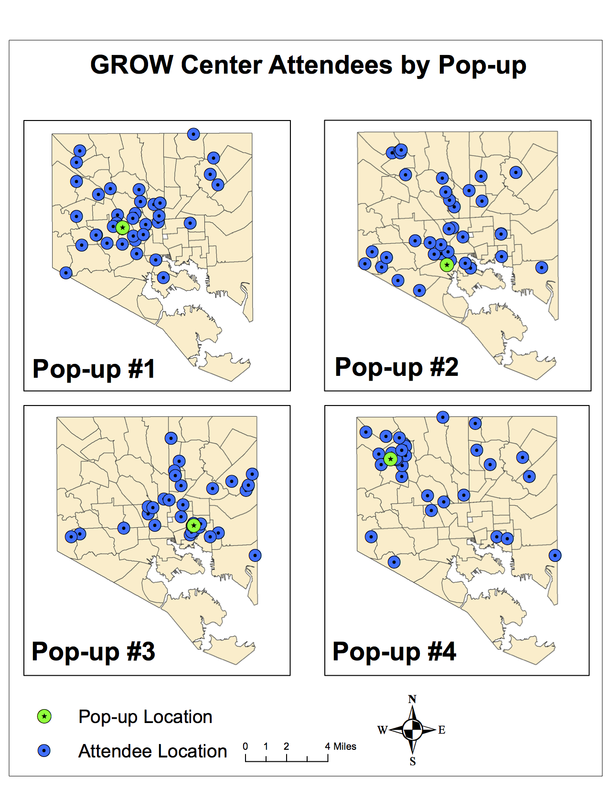
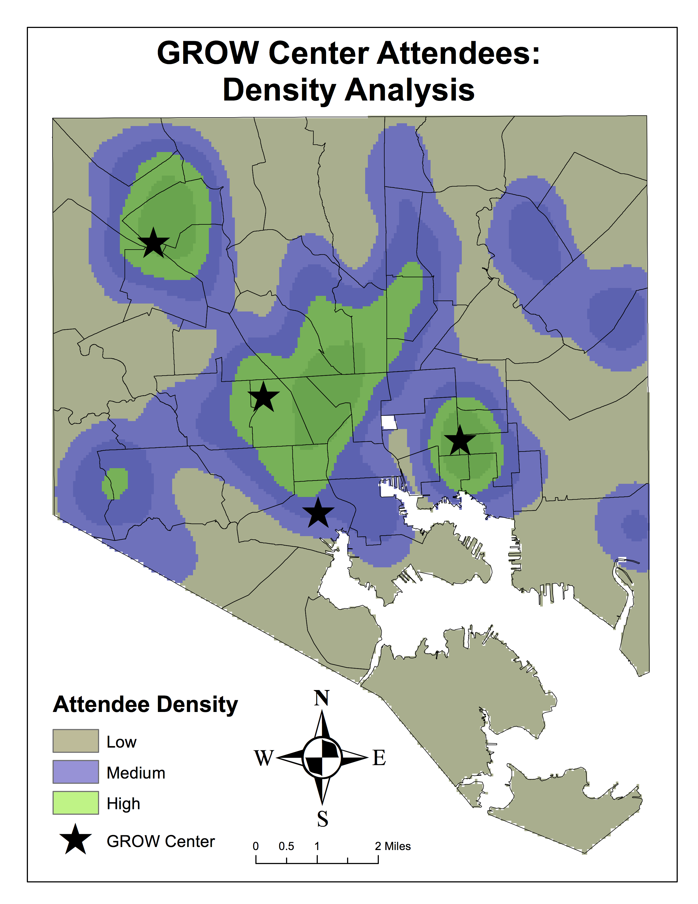

---
#### Project Description

The purpose of this study is to explore how and where resources, provided by Baltimore City Department of Public Works (DPW) GROW (Green Resources and Outreach for Watersheds) Centers, are accessed by city residents. This study looks specifically at where GROW Center users originate, and the demographics of these areas. In doing so, insight into the relationships between Baltimore City residents and GROW Center pop-ups is revealed. The target population in this study are GROW Center users/attendees.

*a full write-up can be found [here](GES 686 Final Project - Lageman.pdf) including background, methods and results#### Maps

#### Data

GROW Center Event Data (Confidential)

[Baltimore Neighborhood Indicators Alliance](https://bniajfi.org/community/Baltimore%20City/):
* Percentage of Residential Properties that are Vacant & Abandoned (2016)
* Number of Community Managed Open Spaces (2015)
* Median Household Income (2015)
* Percentage of Area Covered by Trees (2011)

#### Conclusions:

Results indicate that GROW Centers attracted a notable local population of participants that also included more distant travelers (Figure 1). This suggests that GROW Centers in different locales are effective at reaching more local greeners. Additionally, most residents using GROW Center resources come from areas of lower income, less trees, more vacant properties and more community open spaces. This is reassuring for GROW Center objectives. Resources provided through GROW Centers are targeted towards community greening activities that promote vacant lot revitalization, maintenance of greenspaces and to increase tree canopy.

Furthermore, by providing materials for free and low cost, residents with little disposable income are able to access materials. Looking at Figure 2, areas of high participant density occur in East and West Baltimore, historically underserved neighborhoods with high numbers of vacancies and lower income. Therefore, it appears that GROW Centers can provide resources for community greening related efforts in areas that can benefit most.
