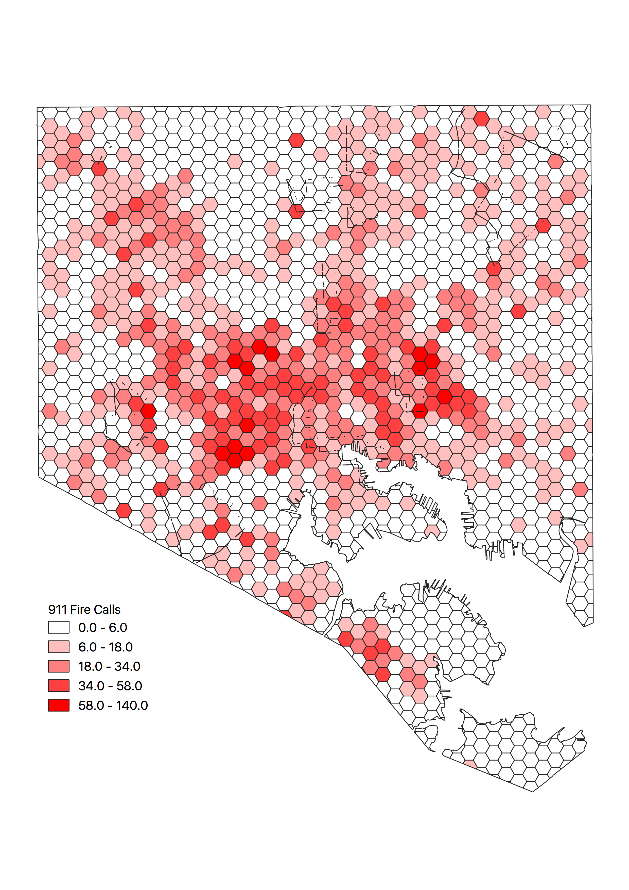
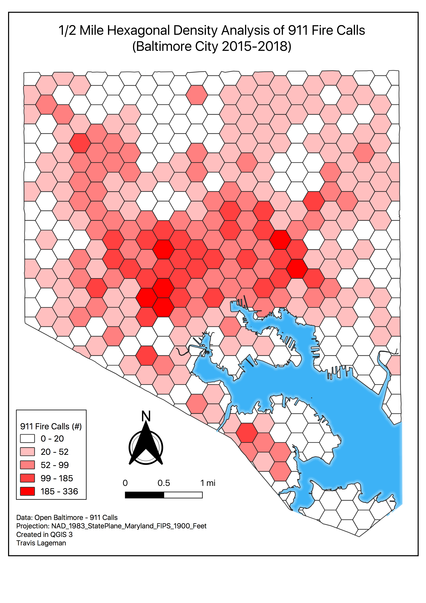
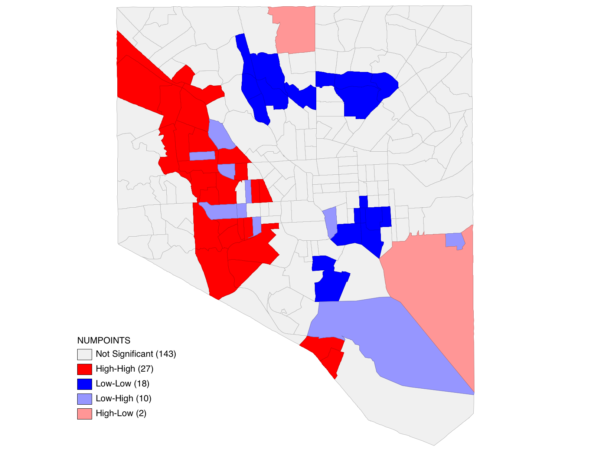
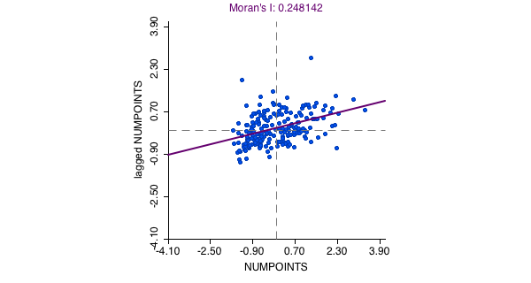

---

#### Project Description: _in progress_

  I will analyze 911 Fire Calls in Baltimore City within the last 3 years.

##### Goals:

* Perform SQL queries to isolate "Fire" calls from 911 Calls Dataset
* Perform Hexagonal Analysis of Fire calls across Baltimore city for all three years
* Create Chloropleth maps of Fire calls by year using Census tracts & create a gif
* Perform Spatial Regression with the following:
  - Independent Variables:
    - Median Household Income
    - Race
    - Vacant Properties
    - Property Build Year
    - Housing Density
    - Landuse (Industrial) *
  - Dependent Variables:
    - 911 Fire Calls

##### Other Ideas:

* Buffer analysis with Fire Stations
* Comparison of Fires based on time of year and/or time of day
* Look for Fire calls within 1/4mi of each other on same day - SQL?

##### Progress:

