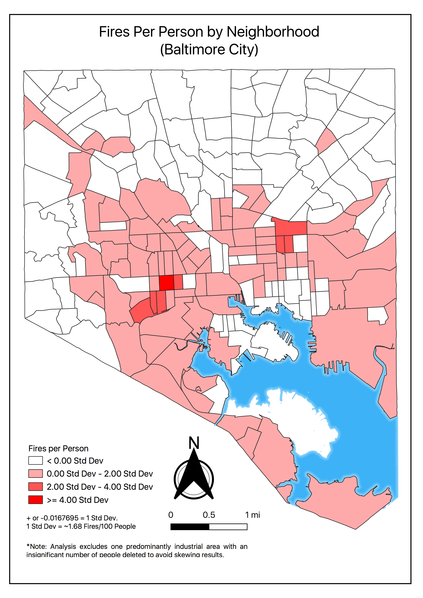
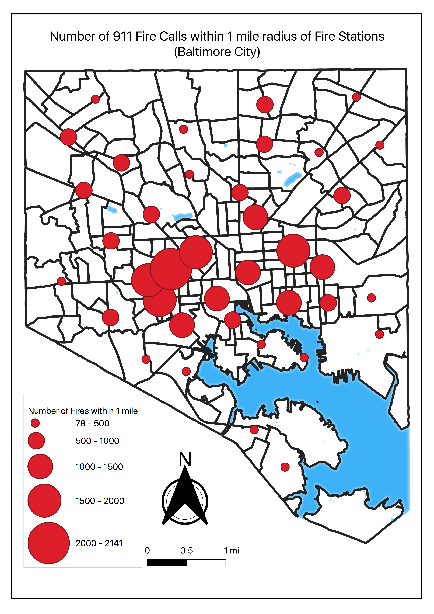
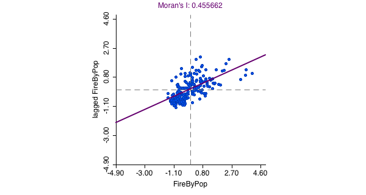
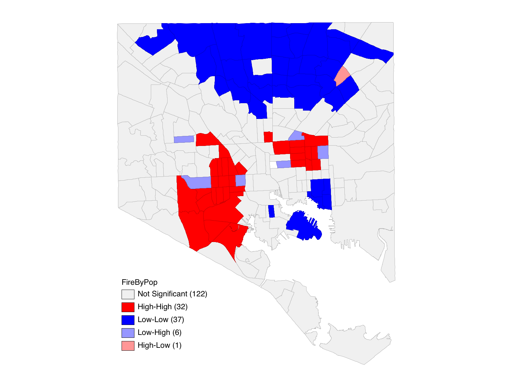
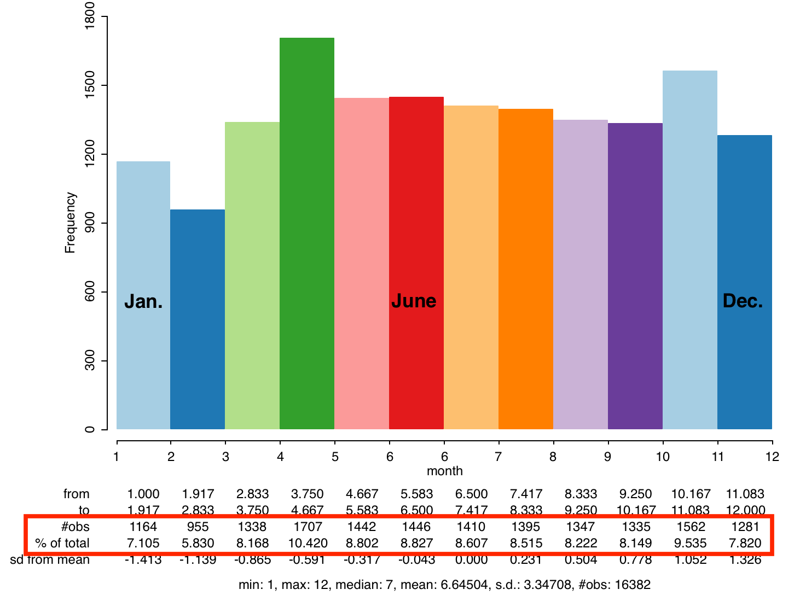
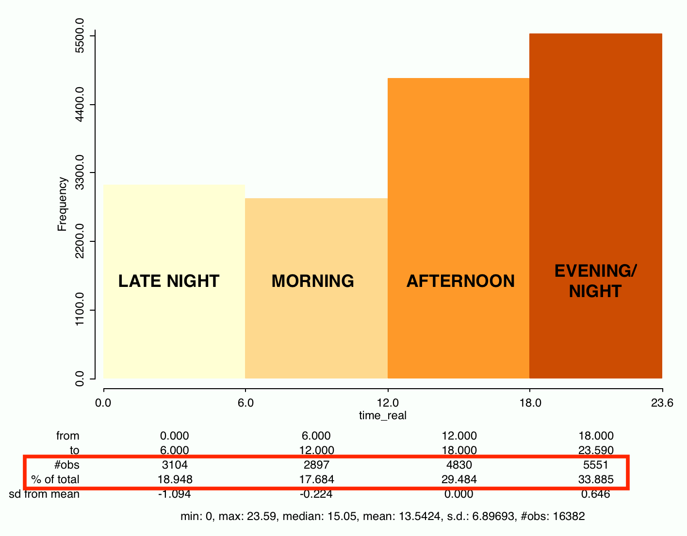
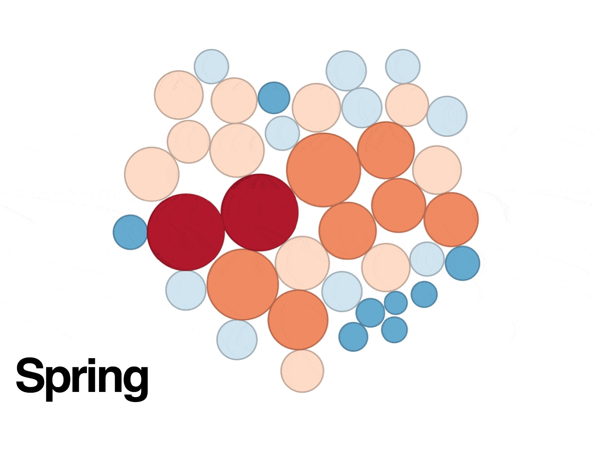

---

### 911 Fires in Baltimore City (2015-2018)

#### Project Description:

911 Fire Calls were downloaded from Open Baltimore from 2015 to December 2018. Call data was geolocated to a point shapefile. TigerLine Census Tracts were downloaded with various socio-economic data. A shapefile of all fire stations in Baltimore City was also retrieved. Using these datasets a variety of analyses, as learned over the semester, were performed. In particualr, the main goal for this project was to perform a spatial regression to answer the following question:
  >__Do socio-economic indicators account for variations in 911 Fire Calls in Baltimore City?__

#### Data

* [Baltimore City 911 Call Log](https://data.baltimorecity.gov/Public-Safety/911-Police-Calls-for-Service/xviu-ezkt) - Open Baltimore
* [Baltimore City Fire Stations](http://gis-baltimore.opendata.arcgis.com/datasets/fire-stations) - Open Baltimore
* [TIGER/Line Demographic & Economic Data](https://www.census.gov/geo/maps-data/data/tiger-data.html) - United States Census Bureau

#### Hexagonal Analysis
First, a hexagonal analysis was performed to determine the density of fires across Baltimore City that included all 911 Fire Calls. This included both 1/4 mi and 1/2 mi hexagons. This analysis showed a concentration of calls in East and West Baltimore, as well as some hot-spots in Northwest and Southern Baltimore but to a lesser extent.

#### Neighborhood Map

A chloropleth map was made to show the distribution of 911 Fire Calls by census tract, accounting for population. The variable represented is Fires per Person. This was represented using standard deviations where 1 standard deviation equals about 1.67 fires per 100 people. The analysis reinforced what was shown in the hexagonal maps, a concentration of fire calls in East and West Baltimore greater than the average value. However, what is also illuminated is the more industrial areas in South Baltimore that also have higher than normal instances of fire calls.

_* Two features were deleted that would have skewed results. The first was the prison facility located in the heart of Baltimore. The second was the Fairfield area in South Baltimore, which is essentially all industrial area with a total population less than 30._

#### Buffer analysis

A 1 mile buffer analysis was performed on every fire station in Baltimore to determine which stations may be the most called upon. A radius of 1 mile was chosen due to it nearly covering the enitre area of Baltimore City as well as most all fire call data points. This analysis showed a similar story again; the fire stations in East and West Baltimore have been more more stressed in terms of the number of fire calls received that are within a 1 mile radius.

#### Spatial regression

The following variables were thought to be of interest that might influence the number of 911 Fire Calls:
  * __Median Household Income (2016)__ was of interest due to the hypothesis that greater income might mean better resources for fire prevention.
  * __Amount of Industrial Area (2010)__ was chosen for the hypothesis that industrial facilities may be more likely to have fire incidents due to chemical and machine and other industrial activities. Industrial Landuse area was calculated as a proportion of census tract area for each census tract.
  * __Amount of Vacant Properties (2010)__ was of interest due to the hypothesis that unmaintained properties will be more susceptible to fire from weather events and/or vandalism. The number of vacant properties was then divded by the number of total properties for each census tract.
  * __Average Property Build Year__ was chosen on the idea of older houses being in worse phsycial condition, thus being more susceptible to fires from electrical failures, exposed wires, etc.

##### Local Moran's I

A Local Moran's I was performed to see if there was spatial autocorrelation with the Fires per Person by Census Tract, which resulted in notable positive spatial autocorrelation (0.455662).

Clustering is observered in East and (South)West Baltimore with census tracts with higher numbers of fire per person, while clustering is also observed in the North of Baltimore with census tracts with lower numbers of fire per person.

##### Regression

The next step was to perform a spatial regression using the variables of interest. This was performed in GeoDa. Inputting the variables and running a Classic OLS Regression indicated that a Spatial Lag Model should be used based on the LaGrange Multiplier significance value. [Output](RegressionOutput.txt)

[Spatial Lag Model Output](SpatialLagOutput.txt):

         Variable         Coefficient       Std.Error        z-value      Probability

         W_FireByPop      0.219634          0.0862647         2.54605       0.01090
            CONSTANT     -0.034995          0.112732         -0.310427      0.75624
            MedHHI16     -1.78525e-07*      3.80395e-08      -4.69316       0.00000
          IndAreaPro      0.0220273*        0.00525136        4.19459       0.00003
          YEAR_BUILD      2.67198e-05       5.73416e-05       0.465975      0.64123
              VacPro      0.0751002*        0.0113701         6.60506       0.00000

##### Discussion

The results of the regression showed _statistically_ significant effects of for three variables of interest. The model predicts that as the dependent variable (FireByPop) increases by 1 there will be corresponding increases in proportion of vacancies (VacPro) by 0.0751002 and proportion of industrial area (IndAreaPro) by 0.0220273. Simply put, as number of fire calls increases per person, the number of vacancies and amount of industrial area increases. For median household income (MedHHI16), the model indicates that income decreases with increase in number of fire calls per person. However, it indicates a incredibly small change in income(-1.78525e-07). As for Average Property Build Year (YEAR_BUILD), the result was not statistically significant (0.465975).

While this does not prove the previously supplied hypotheses correct, it does make them sound reasonable with the exception of median household income and average property year build. There are likely other factors that could be explored that may contribute to the distribution of 911 fire calls in the city.

#### Other Analyses

Other tools in GeoDa were explored that might provide some further insight into 911 fire calls.

##### Histograms

Data points for fire calls (from 2015-2018) were coded based on the month of the call as well as the time of day that the call was made. For the month, coding was done by integers, 1-12 for each month. The below histogram shows a relatively even spread of fires by month, with a max in April and a min in February.

For time of day, coding was done by morning (6am-12pm), afternoon (12pm-6pm), evening/night (6pm-12pm), and late night. The below histogram shows a greater number of calls in the evening/night. This may be for the fact that people have returned home for the day performing a number of activities such as cooking that may contribute to fire incidents. Additionally, for a call to be made for a Fire at home, the person would need to be home to make the call.

##### Cartogram

One last feature that was explored in GeoDa was the Cartogram. Cartograms were created for fire station points based on the number of fires within 1 mile of each station in a given season (i.e. Fall, Spring, etc.) for the year 2015. Those cartograms were combined into a GIF, and while not very insightful, it shows how the Eastern and Western Baltimore Fire Stations have higher number of nearby fire calls throughout the year, irregardless of the season.

