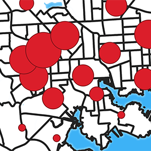

<!--This is the first row of projects -->

### Project 1

[See more details here.](https://tlageman.github.io/Project1/Lageman_Project1.html)

This is a teaser image of a 3-D Map showing Resident 311 Rat-related requests in Baltiomre City from 2014 to 2018. The city is divided into 1/4 mile hexagons with a heigh attribute equal to the number of requests in a given hexagon. Neighborhoods are identified as majority white or black. A 2-D map is also included.

<small>__Tools__: QGIS, Qgis2threejs, Database Manager

<small>__Data__:
[Baltimore City Real Property Database](https://gis-baltimore.opendata.arcgis.com/datasets/b41551f53345445fa05b554cd77b3732_0)
,[Baltimore City Community Statistical Area with Demographic Data](https://bniajfi.org/)
,[311 Service Requests for Rat/Rodent Problems](https://data.baltimorecity.gov/City-Services/311-Customer-Service-Requests/9agw-sxsr)
,[Baltimore City Digital Elevation Model - MD iMAP](https://imap.maryland.gov/Pages/lidar-dem-download-files.aspx)
</small>

### Project 2

[See more details here.](https://tlageman.github.io/Project2/Project2_Lageman.html)

This is a teaser image of a gif showing the percentage of housing citations by neighborhood in Baltimore for each year form 2008-2018.

<small>__Tools__: QGIS, ArcGIS, Photoshop </small>

<small>__Data__:
[Baltimore City Housing Citations Dataset](https://data.baltimorecity.gov/Housing-Development/Housing-Citations/pugq-wdem)
, [Baltimore City Neighborhoods Shapefile](http://gis-baltimore.opendata.arcgis.com/datasets/neighborhoods) </small>

<!--This is the second row of projects -->

### Project 3

[See more details here.](https://tlageman.github.io/project1_bamap/Project3_Lageman.html)

This project shows the geographic distribution of attendees from four pop-up events of a developing community greening initiative called GROW Centers. The overall distrubtion is analyzed using a kernel analysis. In addition, each pop-up and its respective attendees are identified. A report accompanies the analysis.

<small>__Tools__: ArcGIS, Kernel Analysis

<small>__Data__:
Attendee Data Collected by GROW Center Staff (Confidential), [Baltimore Community Statistical Areas  with Demographic/Census Data](https://bniajfi.org/community/Baltimore%20City/) </small>

### Project 4

[See more details here.](https://tlageman.github.io/Project4/FinalProject_Lageman.html)

This is where my final project for GES 687 will be.

<small>__Tools__: QGIS, R

<small>__Data__:
[TBD](TBD.com) </small>

